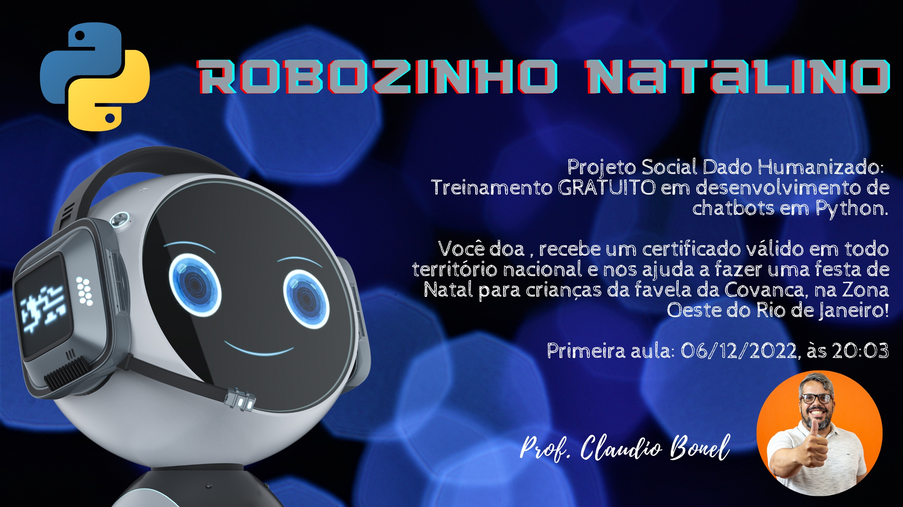

# Projeto Social Dado Humanizado! 

## Robozinho Natalino: Treinamento GRATUITO em Desenvolvimento de chatbots em Python

## Vídeo de apresentação

## Conteúdo do treinamento

<a href = "https://youtu.be/Gjgv42Z5z_4">Aula 01 - Fundamentos da NLP (Processamento em Linguagem Natural), focalizada em chatbots</a>
 
<a href = "https://youtu.be/KZCMFAc3UAM">Aula 02 - Projeto de desenvolvimento de chatbots, utilizando uma árvore de decisão, integração e interação do Telegram</a>
 
<a href = "https://youtu.be/zqUfVqDkf9o">Aula 03 - Desenvolvendo um algoritmo para salvar dados das conversas com o chatbot do Telegram</a>
 
Aula 04 - Desenvolvimento da terceira parte do chatbot, exemplos e testes
 
Aula 05 - Disponibilizando o chatbot no Telegram  para utilização
 
 
O conteúdo pode sofrer ajustes de acordo com o andamento das aulas e o feedback dos/as participantes.

## Sobre o que é?

Faaala coisa rica! Tudo bem com vc?
 
 
O Robozinho Natalino é uma iniciativa do Projeto Social Dado Humanizado e, dessa vez vamos preparar um treinamento de Desenvolvimento de Chatbots em Python, para arrecadarmos grana e realizarmos uma festa de Natal incrível para crianças da Favela da Covanca, na Zona Oeste do Rio de Janeiro!
 
 
O treinamento é 100% gratuito e ficará no meu Youtube eternamente! Caso você queira receber o certificado do treinamento, deverá realizar uma doação para o projeto (durante o tempo o que as doações estiverem abertas) e, é claro, desenvolver as atividades propostas para me enviar e ser avaliado/a.
 
 
A cada R$ 1,00 doado, eu coloco mais R$ 1,00 do meu bolso. Ou seja, se alcançarmos a meta de R$ 2.500,00, colocarei mais R$ 2.500,00 e teremos um total de R$ 5.000,00!
 
 
Dúvidas? Fale comigo.
 
 
E-mail: claudiobonel@gmail.com
 
Whats app: (21) 995147746
 
 
Tmj e boas análises!
 
Claudio Bonel

## Como doar?

Acesse >> https://apoia.se/robozinhonatalino
 
Sua doação fará com que uma criança, possa curtir o NATAL de forma mais leve, feliz e você ainda leva um Certificado pra casa :)

## Aonde assisto as aulas?

Em meu canal do Youtube: http://youtube.com/c/ClaudioBonel
 
Para acessar diretamente, acesse a lista do Robozinho Natalino: https://youtube.com/playlist?list=PLPP4r1UqnhGp13iYi4C1WN99o3SSgCpXJ

## Contatos

E-mail: contato@profclaudiobonel.com.br
 
Instagram: @bonelclaudio
 
LinkedIn: http://br.linkedin.com/in/bonel